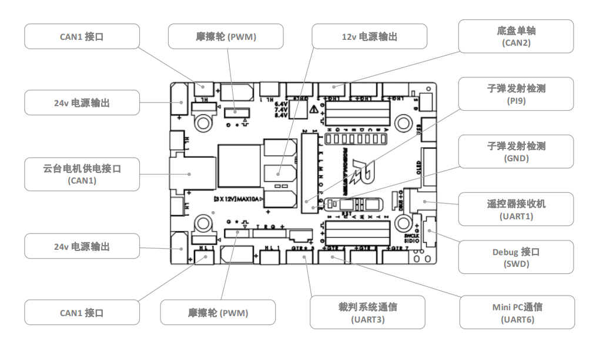
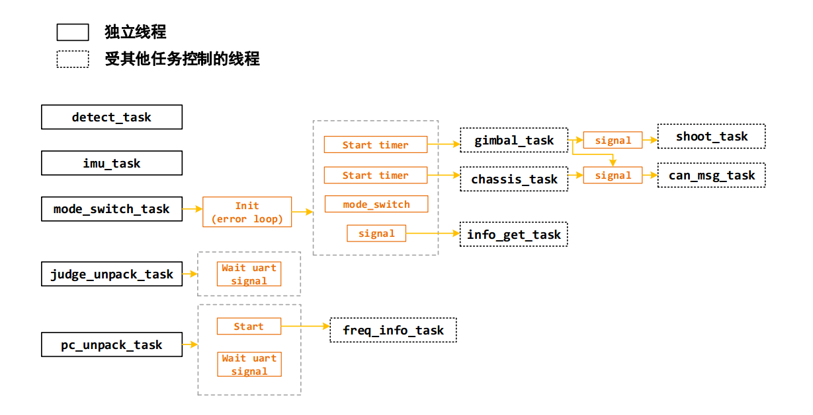
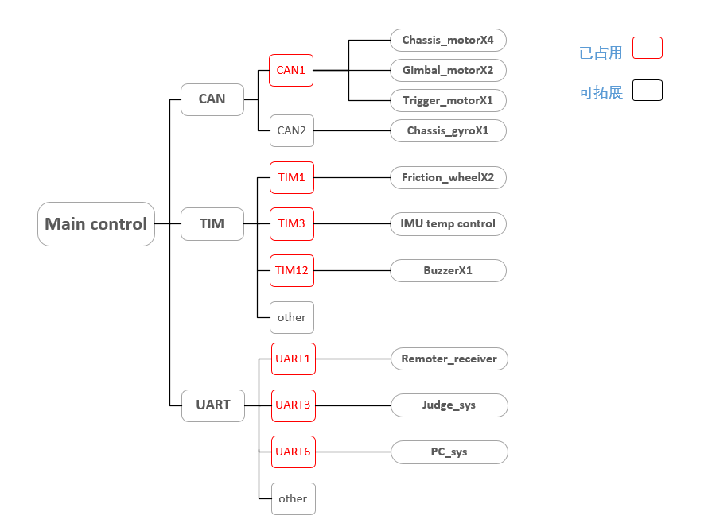
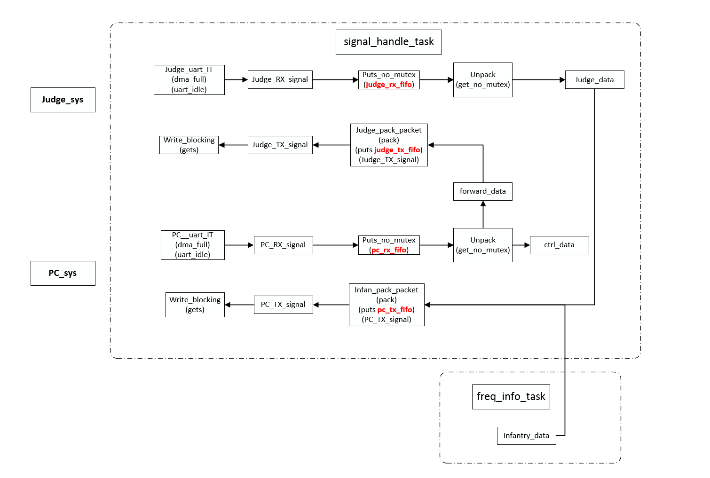

## RoboMky Firmware

### Team Information

**Team Monkey**

CMU Robotics Capstone 16-450 and 16-474.

Robotic jogging companion project: _robomonkey_

### Description

This is a STM32F4 firmware for Robomaster development board type A.

Here are some features implemented in this firmware:

- Processes commands for driving the Robomaster rm_infantry mobile chassis
- Sends feedback and monitoring information to PC via USART

### Software Environment

 - Toolchain/IDE : MDK-ARM V5
 - package version: STM32Cube FW_F4 V1.16.0
 - FreeRTOS version: 9.0.0
 - CMSIS-RTOS version: 1.02

### Coding Standards

- 变量和函数命名方式遵循 Unix/Linux 风格
- 在 Application/AppCtrl 中都为强实时的控制任务，禁止使用任何阻塞操作
- 在其他任务中使用的阻塞操作要设置合理的超时时间，优先级、频率不同的任务谨慎使用互斥锁等阻塞操作，防止优先级翻转，如频率较低的 detect_task 和频率较高的 info_get_task

### Communication Protocol

- 协议文档  [protocol](Doc/protocol/ch/readme.md)
- en doc [document](Doc/en/readme.md)

## Quick Start

### Hardware Interfaces

主控板使用 RM 开发板 A 型，各个功能接口的位置如下：



## Working Modes

*Note：*

只有黑体部分为自动模式下能用到的各模块工作模式，其他工作模式不能在自动模式下切换。

### Chassis

```c
typedef enum
{
  CHASSIS_RELAX          = 0,
  CHASSIS_STOP           = 1,
  MANUAL_SEPARATE_GIMBAL = 2,
  MANUAL_FOLLOW_GIMBAL   = 3,
  DODGE_MODE             = 4,
  AUTO_SEPARATE_GIMBAL   = 5,
  AUTO_FOLLOW_GIMBAL     = 6,
} chassis_mode_e;
```

| Chassis Mode             | Feature              |
| ------------------------ | -------------------- |
| CHASSIS_RELAX            | 底盘断电                 |
| CHASSIS_STOP             | 底盘停止/刹车              |
| MANUAL_SEPARATE_GIMBAL   | 手动模式底盘云台分离           |
| MANUAL_FOLLOW_GIMBAL     | 手动模式底盘跟随云台           |
| **DODGE_MODE**           | 底盘躲避模式，底盘固定旋转，平移不受控制 |
| **AUTO_SEPARATE_GIMBAL** | 底盘和云台分离模式，旋转、平移受上层控制 |
| **AUTO_FOLLOW_GIMBAL**   | 底盘跟随云台，平移受上层控制       |

## 程序说明

### 程序体系结构

#### 体系框架

1. 使用免费及开源的 freertos 操作系统，兼容其他开源协议 license；
2. 使用标准 CMSIS-RTOS 接口，方便不同操作系统或平台间程序移植；

#### 内部结构

1. 多任务环境，相比传统步兵控制框架，可以直接实现多线程逻辑，以及阻塞任务；
2. 较为完备的底层上层通信协议，实现上层对步兵各个机构模块的反馈信息获取和控制；
3. 内部程序模式切换、数据、控制各个任务隔离处理，方便添加和裁剪功能；
4. 底盘、云台、发射等机构，内部的控制模式去耦合，便于不同需求控制时的模式切换；

#### 程序框架

1. 基于 HAL 库的 BSP 层，主要提供can、uart、spi、flash、io等板级的配置和通信接口；
2. 数据交互层，这里是程序中会调用 BSP 层函数唯一的地方，主要为应用程序和硬件设备的数据交互；
3. 通信层，负责数据和 uart 硬件间发送和接收，以及这些数据的打包、解析，包含协议部分；
4. 信息获取，交互层可以直接使用的数据、通信层解析好的数据，在这个任务中获取后转化为反馈和控制信息；
5. 模式切换，在不修改控制架构的情况下，实现现有机构功能模式的自定义组合唯一需要修改的地方；
6. 控制任务，云台、底盘、射击这三个机构的控制，包含这些机构的示例模式。

### 软件体系

#### 程序启动时序

各个任务的启动时序图



### 硬件体系

1. 主控 MCU：STM32F427IIHx，配置运行频率180MHz
2. 模块通信方式：CAN；CAN设备：电机电调、陀螺仪模块
3. 上下层通信方式：uart
4. 麦轮安装方式，X型

#### 硬件连接框图



### 协议数据

#### 数据分类

协议数据按照通信方向可以分为两大类：

底层发送给上层的数据：

1. 反馈信息：包含各个机构传感器反馈信息、底层计算出来的一些反馈信息；
2. 底层状态信息：包含底层设备运行状态、底层对上层数据的一些响应等；
3. 转发数据：包含裁判系统的全部信息、服务器端的自定义信息；

底层接收的上层数据：

1. 控制信息：上层对底层 3 个执行机构的控制信息；
2. 配置信息：上层对机器人如轮距、轴距、云台位置等结构配置信息，以及上层程序运行状态，底层响应级别等；
3. 转发数据：需要底层转发给裁判系统，并最终在客户端上显示出来的用户自定义信息；

#### 数据流图



